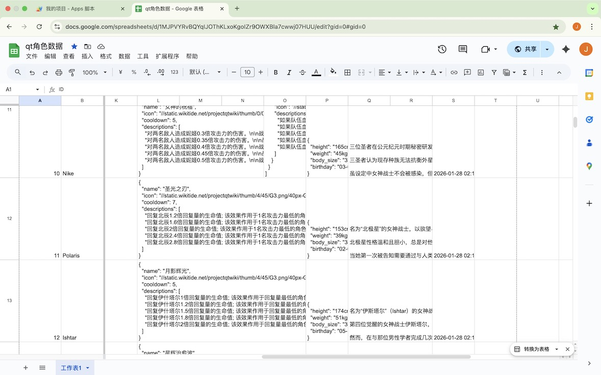
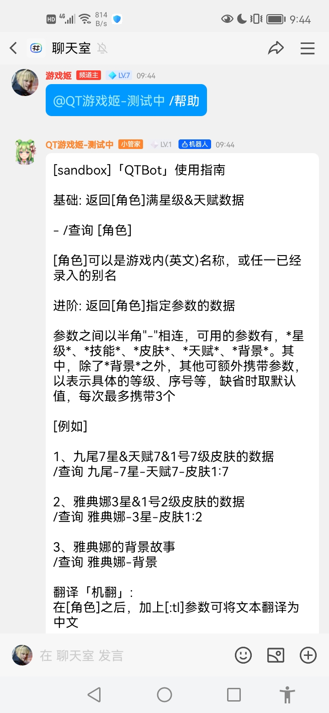
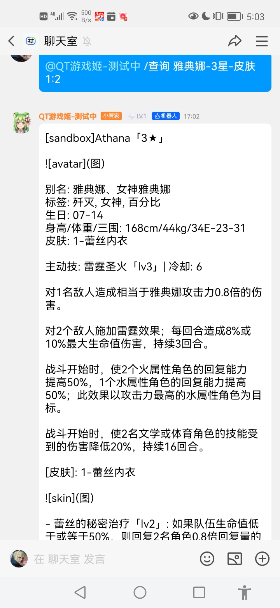

# QTBot

一个PQT的wiki机器人，基于qq平台运行，用于查询游戏角色数据，通常角色、女神。

（无法显示图片，藤子不给）

## 配置

1、机器人配置

> .env.prod

想要在QQ中运行，需要前往QQ开放平台申请机器人。

```text
DRIVER=~httpx+~websockets
LOCALSTORE_USE_CWD=true
LOG_LEVEL=DEBUG

# 服务器配置
HOST=127.0.0.1
PORT=8080
DEBUG=true
QQ_IS_SANDBOX=true
QQ_BOTS='[
  {
    "id": "机器人id",
    "token": "机器人令牌",
    "secret": "机器人秘钥",
    "type": "机器人类型",
    "intent": {
      "c2c_group_at_messages": true
    }
  }
]'
```

2、其他配置

config.example.ini重命名为config.ini；

```text
[db]
db_path=data/wiki.db

[baidu_fanyi]
appid=百度翻译appid
app_key=百度翻译秘钥
endpoint=http://api.fanyi.baidu.com/api/trans/vip/translate

[crawler]
list_page_paths=/wiki/Character_List,/wiki/Goddess_List

[storage]
# google_sheets或local_json
type=local_json

[google_sheets]
api_key=随机生成字符
save_characters_endpoint=保存角色端点
get_characters_endpoint=获取数据端点

[local_json]
file_path=data/characters.json
```

3、外部存储

默认为本地json文件，如果想要多人协作，可考虑数据放到谷歌表格。

1）本地json

本地存储的方式比较简单，编辑data/characters.json文件后，@机器人同步文件数据即可。

> @机器人 /su 同步数据

```text
[storage]
type=local_json

[local_json]
file_path=data/characters.json
```

2）谷歌表格

这种方式需要配合Apps Scripts来完成存取操作，所需脚本代码位于"根目录/apps_scripts/"文件夹内，并且部署机器人所在服务器需要能连接外网，否则无法访问：

- 创建一个谷歌表格；
- 将角色数据characters.json、角色字段映射field_mappings.json上传到谷歌硬盘，把新建表格的id、名称输入init_characters.js后，将脚本放到https://script.google.com/home?hl=zh-cn执行一次（该脚本无需部署），完成表格初始化；
- 部署get_characters.js、save_characters.js脚本，部署的配置为"类型-Web应用，执行身份-我，有访问权限的人员-任何人"，将生成的链接填写到apps_scripts指定区域；
- 部署脚本参数，秘钥、表格id、表格名称，其中，秘钥为随机生成，用于校验脚本的调用，设置到：项目设置 -> 脚本属性，API_KEY=秘钥，SHEET_ID=表格id，SHEET_NAME=表格名称，两个脚本都需要；

这时候，将谷歌表格的权限分享出去，就可以实现'多人协作+机器人同步数据'的工作模式了。

注：Apps Scripts可免费使用，但额度有限，不应该频繁调用，不过应付这种低频场景应该还是错错有余的，[自行查看](https://developers.google.com/apps-script/guides/services/quotas?hl=zh-cn)

```text
[storage]
type=google_sheets

[google_sheets]
api_key=随机生成字符
save_characters_endpoint=保存角色端点
get_characters_endpoint=获取数据端点
```



## 运行

依赖安装完成后，使用以下命令启动程序：

> nb run

可指定指定配置文件(.env.xxx)：

同时修改bot.py中的driver, 如qq机器人，需要from nonebot.adapters.qq import Adapter

> ENVIRONMENT=dev_console nb run

未导入数据时, 先执行以下命令再运行：

> python -m scripts.import_mock_data

## 功能概览

- 查询角色数据
- 从wiki网站抓取数据
- (从谷歌表格)同步数据
- 推送数据(至谷歌表格)

## 使用指南（面向普通用户）

0、手册

> @机器人 /帮助



1、基本格式

> @机器人 /查询 [角色]

[角色]可以是游戏内名称，或者任一别名。

不加其他参数，默认显示：满星（主动技能+觉醒被动），以及天赋数据，如下：

> @QT游戏姬-测试中 /查询 星神

```text
Aeon's Echo Athena「8★」


别名: 星神、星神雅典娜
标签: 运动, 3年级, 雷, 联动角色, 反伤坦
爱好: 向阿波罗学习
羁绊: 白狼, 卡米尔

主动技: 闪光护盾「lv5」| 冷却: 5

对2个敌人造成相当于雅典娜攻击力0.75倍的雷电伤害。

赋予其他角色反伤效果，将技能攻击伤害的40%（不包括减益伤害）反射给敌人，持续8回合。

对雅典娜施加圣盾效果；圣盾数值为目标战斗初始生命值的0.2倍。若角色在5回合内受到直接攻击，则先扣除角色自身的圣盾数值。

在护盾增益效果持续时间结束时，将剩余的神圣护盾值作为伤害施加到敌方队伍的生命值上。

圣盾激活时，受到的持续伤害增加5% 。

觉醒被动: 不动如山「lv3」

战斗开始时，3个角色有80%的几率闪避“雷霆”效果，持续16回合。

战斗开始时，使雅典娜受到的伤害减少30%，其他角色受到的伤害减少20%，持续16回合。

战斗开始时，赋予雅典娜嘲讽效果；所有非风属性敌人优先攻击她自己，风属性敌人优先攻击其他队友，持续16回合。

天赋: 释放潜能「lv10」

使2名角色的攻击力和生命值提高10%。
```

2、进阶

查询时，可携带参数，以半角短线连接，可用参数：角色[:tl]-[星级]-技能[等级]-皮肤[序号][:等级]-天赋[等级]-背景， 一次最多携带3个。

参数说明：

1）'tl'可以将当前角色信息翻译为中文（百度翻译）

如果当前角色还没翻译时，可以使用指令，如：/查询 雅典娜:tl

2）星级

目标角色的星级，1-8，'星级'同等于'技能'，如：7星=技能7

3）天赋

同上，1-10

3）皮肤

如果目标角色有皮肤时，可使用该参数

4）背景

返回该角色的背景故事

***

综合举例，想要查看3星雅典娜，1号皮肤2级数据时，则为：

> @QT游戏姬-测试中 /查询 雅典娜-3星-皮肤1:2



```text
Athana「3★」


别名: 雅典娜、女神雅典娜
标签: 歼灭, 女神, 百分比
生日: 07-14
身高/体重/三围: 168cm/44kg/34E-23-31
皮肤: 1-蕾丝内衣

主动技: 雷霆圣火「lv3」| 冷却: 6

对1名敌人造成相当于雅典娜攻击力0.8倍的伤害。

对2个敌人施加雷霆效果；每回合造成8%或10%最大生命值伤害，持续3回合。

战斗开始时，使2个火属性角色的回复能力提高50%，1个水属性角色的回复能力提高50%；此效果以攻击力最高的水属性角色为目标。

战斗开始时，使2名文学或体育角色的技能受到的伤害降低20%，持续16回合。

[皮肤]: 1-蕾丝内衣


- 蕾丝的秘密治疗「lv2」: 如果队伍生命值低于或等于50%，则回复2名角色0.8倍回复量的生命值。（仅计算进入战斗前的恢复量）
```

## 超级用户指令

以/su前缀开头。

1、抓取数据

分为抓取单角色，和抓取多角色，如果已经存在则会跳过；抓取到的数据会自动同步到外部存储。

```text
1）@机器人 /su 抓取-女神-10条数据，抓取-角色-10条数据
2）@机器人 /su 抓取-[角色]
3）@机器人 /su 抓取-10条数据
```

2、从外部存储同步到数据库

将外部数据同步到数据库。

> @机器人 /su 同步至数据库

3、从数据库同步到外部存储

同步数据库中的一个角色至外部存储（目前只支持一个，场景不多）；如果数据已存在，执行更新，否则添加。

> @机器人 /su 同步至外部存储:[角色]

4、从wiki中更新数据

若wiki页面有数据更新，则可以调用指令同步至数据库

> @机器人 /su 抓取更新:[角色]